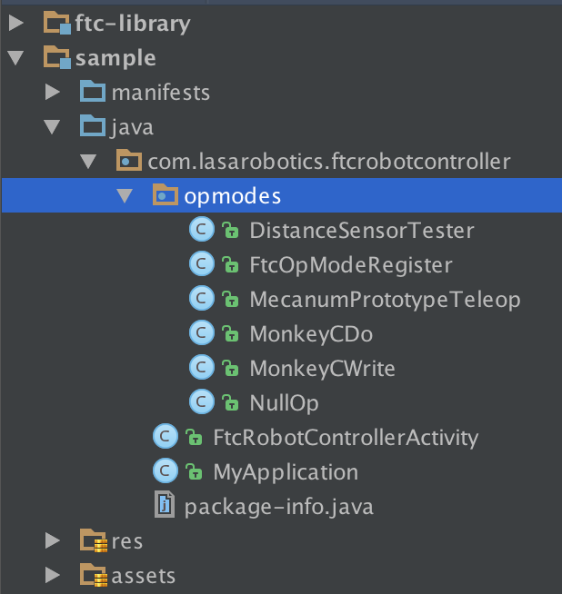

# FTCLibrary
##Introduction
Welcome to FTCLibrary! The goal of this library is to provide a clean, well documented and easy to use library to help all FTC teams. We encourage you to look around, try out the library, and submit any issues you find. For those new to using libraries in Android, a full getting started guide can be found below.
##Setup
###Download Android Studio
Android Studio is the IDE used for developing Android apps. It is available for Windows,OSX and most Linux distributions and can be downloaded from [here](http://developer.android.com/sdk/index.html).
###Get the project
The most recent stable version of FTCLibrary can be found on [this page](https://github.com/lasarobotics/FTCLibrary/releases). Simply dowload the attached archive and extract it anywhere on your computer. Alternitivly, you can clone the repository in git or browse to a specific branch to view development versions.
####Open the Project
From the Android Studio menu, select `Open an existing Android Studio Project` and browse to the location of the library. Android Studio will begin running setup and generate the necessary files to use the library. Once done, you should see a `samples` modules
such as shown here . You can begin edditing the OPModes in the sample module to code your robot with the library!
##Contributing
Help in any and all areas is welcomed and encouraged. If you would like to help, please fork the library and pull request changes into the `staging` branch.  